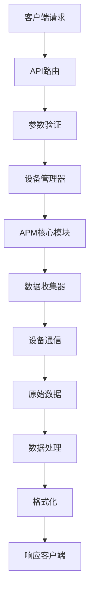
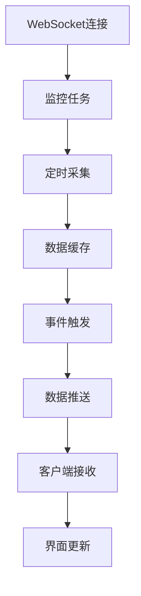

# 系统设计

## 🏗️ 架构概述

SoloX 采用分层架构设计，确保系统的可维护性、可扩展性和高性能。

## 🔧 核心模块设计

### 1. APM 核心模块

```python
class AppPerformanceMonitor:
    """应用性能监控核心类
    
    职责:
    - 性能数据收集调度
    - 多平台适配
    - 数据预处理
    - 异常处理
    """
    
    def __init__(self, pkgName, platform, deviceId, **kwargs):
        self.pkgName = pkgName
        self.platform = platform
        self.deviceId = deviceId
        self._init_collectors()
    
    def _init_collectors(self):
        """初始化数据收集器"""
        if self.platform == Platform.Android:
            self.cpu_collector = AndroidCpuCollector()
            self.memory_collector = AndroidMemoryCollector()
        elif self.platform == Platform.iOS:
            self.cpu_collector = IOSCpuCollector()
            self.memory_collector = IOSMemoryCollector()
```

### 2. 设备管理模块

```python
class DeviceManager:
    """设备管理器
    
    职责:
    - 设备发现和连接
    - 设备状态监控
    - 权限管理
    - 连接池维护
    """
    
    def __init__(self):
        self.connected_devices = {}
        self.connection_pool = ConnectionPool()
    
    def discover_devices(self, platform):
        """发现可用设备"""
        
    def connect_device(self, device_id):
        """连接设备"""
        
    def get_device_info(self, device_id):
        """获取设备信息"""
```

### 3. 数据收集器

```python
class BaseCollector:
    """数据收集器基类"""
    
    def collect(self):
        """收集数据接口"""
        raise NotImplementedError
    
    def validate_data(self, data):
        """数据验证"""
        
    def format_data(self, raw_data):
        """数据格式化"""

class AndroidCpuCollector(BaseCollector):
    """Android CPU 数据收集器"""
    
    def collect(self):
        # 通过 /proc/stat 获取 CPU 数据
        app_cpu = self._get_app_cpu()
        sys_cpu = self._get_system_cpu()
        return self.format_data(app_cpu, sys_cpu)

class IOSCpuCollector(BaseCollector):
    """iOS CPU 数据收集器"""
    
    def collect(self):
        # 通过 tidevice 获取 CPU 数据
        return self._get_ios_cpu_data()
```

## 🔄 数据流设计

### 1. 数据收集流程



### 2. 实时数据推送



## 📊 模块职责划分

### 表现层 (Presentation Layer)
- **Web UI**: 用户界面展示和交互
- **RESTful API**: HTTP接口服务
- **WebSocket API**: 实时数据推送
- **Python SDK**: 编程接口封装

### 业务层 (Business Layer)
- **路由控制**: API请求分发和处理
- **数据处理**: 性能数据分析和计算
- **报告生成**: 性能报告生成和导出
- **配置管理**: 监控参数和系统配置

### 服务层 (Service Layer)
- **APM核心**: 性能监控核心逻辑
- **设备管理**: 设备发现、连接和状态管理
- **任务调度**: 监控任务的调度和管理
- **缓存服务**: 数据缓存和临时存储

### 数据层 (Data Layer)
- **设备通信**: ADB、tidevice等设备通信
- **文件存储**: 日志文件和报告存储
- **配置存储**: 系统配置和用户设置
- **临时数据**: 内存缓存和临时文件

## 🔌 接口设计

### 1. 内部接口规范

```python
class IPerformanceCollector:
    """性能收集器接口"""
    
    def collect_cpu(self) -> CPUData:
        """收集CPU数据"""
        
    def collect_memory(self) -> MemoryData:
        """收集内存数据"""
        
    def collect_network(self) -> NetworkData:
        """收集网络数据"""

class IDeviceConnector:
    """设备连接器接口"""
    
    def connect(self, device_id: str) -> bool:
        """连接设备"""
        
    def disconnect(self, device_id: str) -> bool:
        """断开设备"""
        
    def execute_command(self, command: str) -> str:
        """执行命令"""
```

### 2. 外部接口设计

```python
class APIResponse:
    """API响应标准格式"""
    
    def __init__(self, code: int, msg: str, data: Any = None):
        self.code = code
        self.msg = msg
        self.data = data
        self.timestamp = time.time()
    
    def to_dict(self):
        return {
            'code': self.code,
            'msg': self.msg,
            'data': self.data,
            'timestamp': self.timestamp
        }
```

## 🚀 性能优化设计

### 1. 并发处理

```python
class ConcurrentCollector:
    """并发数据收集器"""
    
    def __init__(self, max_workers=4):
        self.executor = ThreadPoolExecutor(max_workers=max_workers)
    
    def collect_parallel(self, tasks):
        """并行收集数据"""
        futures = []
        for task in tasks:
            future = self.executor.submit(task.collect)
            futures.append(future)
        
        results = []
        for future in as_completed(futures):
            try:
                result = future.result(timeout=5)
                results.append(result)
            except TimeoutError:
                logger.warning("数据收集超时")
        
        return results
```

### 2. 缓存策略

```python
class DataCache:
    """数据缓存管理"""
    
    def __init__(self, max_size=1000, ttl=300):
        self.cache = {}
        self.max_size = max_size
        self.ttl = ttl  # 5分钟过期
    
    def get(self, key):
        if key in self.cache:
            data, timestamp = self.cache[key]
            if time.time() - timestamp < self.ttl:
                return data
            else:
                del self.cache[key]
        return None
    
    def set(self, key, value):
        if len(self.cache) >= self.max_size:
            # LRU策略清理缓存
            oldest_key = min(self.cache.keys(), 
                           key=lambda k: self.cache[k][1])
            del self.cache[oldest_key]
        
        self.cache[key] = (value, time.time())
```

### 3. 连接池管理

```python
class DeviceConnectionPool:
    """设备连接池"""
    
    def __init__(self, max_connections=10):
        self.pool = {}
        self.max_connections = max_connections
        self.lock = threading.Lock()
    
    def get_connection(self, device_id):
        with self.lock:
            if device_id in self.pool:
                return self.pool[device_id]
            
            if len(self.pool) >= self.max_connections:
                # 清理最久未使用的连接
                self._cleanup_idle_connections()
            
            connection = self._create_connection(device_id)
            self.pool[device_id] = connection
            return connection
```

## 🔐 安全设计

### 1. 权限控制

```python
class PermissionManager:
    """权限管理器"""
    
    def check_device_permission(self, device_id):
        """检查设备权限"""
        
    def validate_api_token(self, token):
        """验证API令牌"""
        
    def rate_limit(self, client_id):
        """API限流"""
```

### 2. 数据安全

```python
class DataSecurity:
    """数据安全管理"""
    
    def encrypt_sensitive_data(self, data):
        """加密敏感数据"""
        
    def sanitize_input(self, input_data):
        """输入数据清理"""
        
    def audit_log(self, action, user, details):
        """审计日志"""
```

## 📈 扩展性设计

### 1. 插件化架构

```python
class PluginManager:
    """插件管理器"""
    
    def __init__(self):
        self.plugins = {}
    
    def register_plugin(self, name, plugin_class):
        """注册插件"""
        self.plugins[name] = plugin_class
    
    def load_plugin(self, name):
        """加载插件"""
        if name in self.plugins:
            return self.plugins[name]()
        return None

class BasePlugin:
    """插件基类"""
    
    def initialize(self):
        """插件初始化"""
        
    def execute(self, *args, **kwargs):
        """插件执行"""
        raise NotImplementedError
```

### 2. 配置化设计

```python
class ConfigManager:
    """配置管理器"""
    
    def __init__(self, config_file):
        self.config = self._load_config(config_file)
    
    def get(self, key, default=None):
        """获取配置值"""
        return self.config.get(key, default)
    
    def set(self, key, value):
        """设置配置值"""
        self.config[key] = value
        self._save_config()
    
    def reload(self):
        """重新加载配置"""
        self.config = self._load_config(self.config_file)
```

## 🔄 模块间交互

### 1. 事件驱动架构

```python
class EventBus:
    """事件总线"""
    
    def __init__(self):
        self.listeners = defaultdict(list)
    
    def subscribe(self, event_type, callback):
        """订阅事件"""
        self.listeners[event_type].append(callback)
    
    def publish(self, event_type, data):
        """发布事件"""
        for callback in self.listeners[event_type]:
            try:
                callback(data)
            except Exception as e:
                logger.error(f"事件处理失败: {e}")

# 使用示例
event_bus = EventBus()

# 订阅设备连接事件
event_bus.subscribe('device_connected', on_device_connected)

# 发布设备连接事件
event_bus.publish('device_connected', {'device_id': 'xxx'})
```

### 2. 依赖注入

```python
class Container:
    """依赖注入容器"""
    
    def __init__(self):
        self.services = {}
        self.singletons = {}
    
    def register(self, interface, implementation, singleton=False):
        """注册服务"""
        self.services[interface] = (implementation, singleton)
    
    def resolve(self, interface):
        """解析服务"""
        if interface in self.services:
            impl, is_singleton = self.services[interface]
            
            if is_singleton:
                if interface not in self.singletons:
                    self.singletons[interface] = impl()
                return self.singletons[interface]
            else:
                return impl()
        
        raise ValueError(f"Service {interface} not registered")
```

---

*相关文档: [技术架构](./technical-architecture.md) • [模块结构](./module-structure.md)*