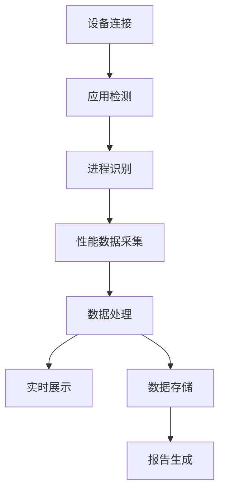
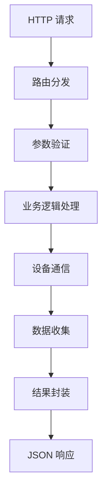

# 技术架构

## 🏗️ 整体架构

SoloX 采用分层架构设计，主要包含以下几个层次：

```
┌─────────────────────────────────────────────────────────────┐
│                    表现层 (Presentation Layer)              │
├─────────────────────────────────────────────────────────────┤
│  Web UI (HTML/CSS/JS)  │  RESTful API  │  Python SDK       │
└─────────────────────────────────────────────────────────────┘
                                │
┌─────────────────────────────────────────────────────────────┐
│                    业务层 (Business Layer)                  │
├─────────────────────────────────────────────────────────────┤
│  Flask 路由控制  │  数据处理  │  性能分析  │  报告生成       │
└─────────────────────────────────────────────────────────────┘
                                │
┌─────────────────────────────────────────────────────────────┐
│                    服务层 (Service Layer)                   │
├─────────────────────────────────────────────────────────────┤
│  APM 核心服务  │  设备管理  │  数据收集  │  监控调度        │
└─────────────────────────────────────────────────────────────┘
                                │
┌─────────────────────────────────────────────────────────────┐
│                    数据层 (Data Layer)                      │
├─────────────────────────────────────────────────────────────┤
│  ADB 通信  │  iOS 设备通信  │  文件存储  │  日志管理        │
└─────────────────────────────────────────────────────────────┘
```

## 🛠️ 技术栈

### 后端技术栈

| 技术 | 版本 | 用途 |
|------|------|------|
| **Python** | 3.10+ | 主要开发语言 |
| **Flask** | 2.0.1+ | Web 框架 |
| **Flask-SocketIO** | 4.3.1 | WebSocket 实时通信 |
| **Werkzeug** | 2.0.3 | WSGI 工具库 |
| **Jinja2** | 3.0.1 | 模板引擎 |
| **Fire** | - | 命令行接口 |
| **Requests** | 2.28.2+ | HTTP 客户端 |
| **LogZero** | - | 日志管理 |
| **PSUtil** | - | 系统信息获取 |

### 设备通信技术

| 技术 | 用途 | 支持平台 |
|------|------|----------|
| **ADB** | Android 设备通信 | Android |
| **tidevice** | iOS 设备通信 | iOS |
| **OpenCV** | 图像处理 | 跨平台 |
| **Scrcpy** | 屏幕录制 | Android |

### 前端技术栈

| 技术 | 用途 |
|------|------|
| **HTML5** | 页面结构 |
| **CSS3** | 样式设计 |
| **JavaScript** | 交互逻辑 |
| **Tabler UI** | UI 组件库 |
| **Chart.js** | 数据可视化 |
| **WebSocket** | 实时数据通信 |

## 📁 项目结构

```
solox/
├── __init__.py              # 包初始化，版本信息
├── __main__.py              # 命令行入口
├── web.py                   # Web 服务主入口
├── debug.py                 # 开发调试模式
├── public/                  # 核心业务模块
│   ├── __init__.py
│   ├── apm.py              # 性能监控核心模块
│   ├── apm_pk.py           # 对比测试模块
│   ├── common.py           # 公共工具类
│   └── scrcpy/             # 屏幕录制工具
├── view/                    # Web 视图层
│   ├── apis.py             # API 路由
│   └── pages.py            # 页面路由
├── templates/               # HTML 模板
├── static/                  # 静态资源
└── __pycache__/            # Python 缓存
```

## 🔧 核心模块设计

### 1. APM 核心模块 (apm.py)

```python
class AppPerformanceMonitor:
    """应用性能监控核心类"""
    
    def __init__(self, pkgName, platform, deviceId, ...):
        # 初始化监控参数
        
    def collectCpu(self):
        """CPU 使用率收集"""
        
    def collectMemory(self):
        """内存使用收集"""
        
    def collectNetwork(self):
        """网络流量收集"""
        
    def collectFps(self):
        """FPS 帧率收集"""
        
    def collectBattery(self):
        """电池信息收集"""
        
    def collectAll(self):
        """全量性能数据收集"""
```

### 2. 设备管理模块 (common.py)

```python
class Devices:
    """设备管理类"""
    
    def getDeviceIds(self):
        """获取连接的设备列表"""
        
    def getPid(self, deviceId, pkgName):
        """获取应用进程 ID"""
        
    def devicesCheck(self, platform, deviceid, pkgname):
        """设备环境检查"""
```

### 3. Web 服务模块 (web.py)

```python
app = Flask(__name__)
app.register_blueprint(api)    # API 路由
app.register_blueprint(page)   # 页面路由

def main(host, port):
    """主服务启动函数"""
    # 多进程启动 Web 服务和浏览器
```

## 🔄 数据流设计

### 1. 性能数据收集流程



### 2. API 请求处理流程



## 🚀 性能优化设计

### 1. 多进程架构
- **主进程**: Web 服务和 UI 交互
- **子进程**: 性能数据收集任务
- **进程池**: 并发处理多个监控任务

### 2. 异步数据处理
- **WebSocket**: 实时数据推送
- **后台任务**: 异步数据收集和处理
- **缓存机制**: 减少重复计算和 I/O 操作

### 3. 内存管理
- **数据分片**: 大数据集分批处理
- **垃圾回收**: 及时释放不用的对象
- **文件流**: 大文件流式处理

## 🔐 安全设计

### 1. 设备权限控制
- **最小权限**: 只获取必要的设备权限
- **权限检查**: 运行时权限状态检查
- **安全通信**: 加密设备通信数据

### 2. Web 安全
- **CORS 配置**: 跨域请求控制
- **输入验证**: 严格的参数校验
- **错误处理**: 安全的错误信息返回

## 📊 监控指标设计

### 1. 数据精度
- **采样频率**: 可配置的数据采样间隔
- **数据校准**: 多源数据交叉验证
- **异常检测**: 异常数据自动过滤

### 2. 数据存储
- **日志文件**: 结构化的性能数据日志
- **JSON 格式**: 标准化的数据交换格式
- **报告模板**: 可定制的报告生成模板

---

*下一步: [快速启动](./03-快速启动.md)*
