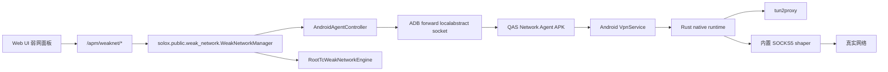

# 弱网工具技术说明

本文面向后续研发迭代、测试验收和问题排查。用户操作步骤见 [弱网测试用户指南](../04-user-guides/weak-network-testing.md)。

## 目标

SoloX 弱网工具用于在 Android 设备上模拟延迟、抖动、丢包和带宽限制，并提供网络质量探测能力。当前支持两类引擎：

| 引擎 | 适用设备 | 权限 | 作用范围 | 说明 |
|------|----------|------|----------|------|
| `agent` | Android 真机/模拟器 | 非 Root，需用户授权 VPN | 指定 App 包名 | 推荐方案，基于 Android `VpnService` |
| `root_tc` | Android Root 设备 | Root | 设备网络接口 | 兼容旧方案，基于 Linux `tc netem` |

探测能力 `/apm/weaknet/probe` 不要求 Root，也不要求安装 Agent。

## 架构



核心文件：

| 路径 | 职责 |
|------|------|
| `solox/public/weak_network.py` | 弱网统一入口、能力探测、引擎选择、API 适配 |
| `solox/public/weaknet/models.py` | `WeakNetworkProfile`、上下行方向配置、带宽解析 |
| `solox/public/weaknet/agent.py` | Agent 安装、授权、状态、apply/clear 控制 |
| `solox/public/weaknet/root_tc.py` | Root `tc netem` 兼容引擎 |
| `android-agent/app/src/main/java/...` | Android Agent 控制面、VPN 服务、JNI bridge |
| `android-agent/native/src/runtime.rs` | Rust native 数据面、tun2proxy 启动、SOCKS5 shaper |
| `scripts/android_agent/build.ps1` | Android Agent native + APK 构建 |
| `scripts/android_agent/package.ps1` | release APK 打包并生成 checksum |
| `solox/public/android_agent/` | Web 端内置分发 APK 与 `checksums.json` |

当前公开 APK：

- 文件名：`solox/public/android_agent/qas-network-agent-0.1.0.apk`
- Android 包名：`io.solox.networkagent`
- 应用 label：`QAS Network Agent`
- Agent 端 UI：顶部标题栏 + 内容卡片流 + `总览` / `弱网` / `日志` / `设置` 四个底部 Tab
- 后台运行：`VpnService` 前台服务、常驻通知、`START_STICKY`

## Android Agent 数据面

Agent 使用 Android 官方 `VpnService` 创建 TUN fd，并通过 `addAllowedApplication(targetPackage)` 只捕获目标 App UID。native 层直接把 TUN fd 交给 `tun2proxy::general_run_async`，再将 tun2proxy 的上游代理指向进程内本地 SOCKS5 服务。

数据流：

1. 目标 App 发起 TCP/UDP 网络请求。
2. Android VPN 将目标 App UID 的流量送入 Agent TUN。
3. tun2proxy 解析 TUN 中的 IP/TCP/UDP 流量。
4. tun2proxy 将 TCP 通过 SOCKS5 `CONNECT` 转给内置 shaper。
5. tun2proxy 将 UDP 通过 SOCKS5 `UDP ASSOCIATE` 转给内置 shaper。
6. shaper 按上下行 profile 注入延迟、抖动、丢包、带宽限制。
7. shaper 使用 Agent 进程自身 socket 访问真实网络。Agent 包不在 VPN allow-list 中，避免回环。

Agent 端 UI 不负责选择弱网模板。模板、目标包名和 profile 仍由 SoloX Web/API 控制端下发，手机端只展示状态、操作入口、日志和诊断信息。

关键约束：

- `target_package` 不能为空，且不能是 Agent 自身包名 `io.solox.networkagent`。
- 非 Root 方案依赖用户授权 VPN，无法静默授权。
- `adb shell curl` 不能代表普通 App 包 UID，不适合作为 Agent 按包名弱网验收依据。
- 真机验收应使用真实 App 包，例如当前游戏 `com.lyjz.chqsy.vivo`。

## 控制协议

Host 侧通过 ADB forward 连接 Agent local abstract socket：

```text
localabstract:solox.networkagent.control
```

请求为单行 JSON，以换行结尾：

```json
{
  "schema_version": 1,
  "request_id": "uuid",
  "command": "start",
  "payload": {
    "target_package": "com.example.app",
    "session_id": "uuid",
    "profile_digest": "sha256",
    "profile": {
      "uplink": {"delay_ms": 100, "jitter_ms": 0, "loss_pct": 0, "bandwidth_kbps": null, "burst_loss_pct": 0},
      "downlink": {"delay_ms": 100, "jitter_ms": 0, "loss_pct": 0, "bandwidth_kbps": null, "burst_loss_pct": 0},
      "protocol": "all",
      "ip_filter": []
    }
  }
}
```

命令：

| command | 说明 |
|---------|------|
| `status` | 返回 `idle` / `active` / `permission_required` 等状态 |
| `start` | 建立 VPN 并应用弱网 profile |
| `stop` | 停止 native runtime，释放 VPN fd，回到 `idle` |

控制 socket 必须避免被半连接卡死。当前实现为每个连接独立线程处理，并设置 5 秒 read timeout。

## Profile 规则

`WeakNetworkProfile` 分为 `uplink` 和 `downlink`：

| 字段 | 类型 | 说明 |
|------|------|------|
| `delay_ms` | int | 固定延迟 |
| `jitter_ms` | int | 随机抖动上限 |
| `loss_pct` | float | 丢包率，0-100 |
| `bandwidth_kbps` | int/null | 带宽限制，单位 Kbit/s |
| `burst_loss_pct` | float | 预留字段 |

旧参数 `delay_ms/jitter_ms/loss_pct/rate` 会映射为上下行相同配置。Agent 模式可单独传 `uplink_*` 和 `downlink_*`。

## API 集成

主要 API 见 [API 文档](../04-user-guides/api-documentation.md#-弱网测试-apiandroid)。

典型调用：

```bash
curl "http://localhost:50003/apm/weaknet/capabilities?platform=Android&device=DEVICE_ID&engine=agent"

curl -X POST "http://localhost:50003/apm/weaknet/agent/install" \
  -d "platform=Android" \
  -d "device=DEVICE_ID"

curl -X POST "http://localhost:50003/apm/weaknet/agent/prepare" \
  -d "platform=Android" \
  -d "device=DEVICE_ID"

curl "http://localhost:50003/apm/weaknet/apply?platform=Android&device=DEVICE_ID&engine=agent&target_package=com.example.app&preset=lte_weak"

curl "http://localhost:50003/apm/weaknet/clear?platform=Android&device=DEVICE_ID"
```

## APK 构建与打包

前置条件：

- 已执行或具备 `scripts/android_agent/bootstrap.ps1` 准备出的工具链。
- `runtime/android-toolchain/` 下存在 JDK、Android SDK、NDK、Gradle、Rust Android sysroot。
- `android-agent/native/third_party/tun2proxy` 已存在 vendored 源码。
- Cargo vendor 目录可用：`runtime/android-toolchain/downloads/cargo-vendor`。

调试构建：

```powershell
powershell -NoProfile -ExecutionPolicy Bypass -File scripts/android_agent/build.ps1 native assembleDebug
```

release 打包并复制到 Web 内置目录：

```powershell
powershell -NoProfile -ExecutionPolicy Bypass -File scripts/android_agent/package.ps1
```

输出：

```text
solox/public/android_agent/qas-network-agent-<version>.apk
solox/public/android_agent/checksums.json
```

`checksums.json` 包含：

- `version`
- `version_code`
- `package_id`
- `min_protocol_version`
- `apk`
- `sha256`

校验签名：

```powershell
$apk = "D:\workDir\githubwork\SoloX\solox\public\android_agent\qas-network-agent-0.1.0.apk"
$apksigner = "D:\workDir\githubwork\SoloX\runtime\android-toolchain\android-sdk\build-tools\36.0.0\apksigner.bat"
& $apksigner verify --verbose $apk
```

手动安装：

```powershell
$adb = "D:\workDir\githubwork\SoloX\runtime\android-toolchain\android-sdk\platform-tools\adb.exe"
$apk = "D:\workDir\githubwork\SoloX\solox\public\android_agent\qas-network-agent-0.1.0.apk"
& $adb -s DEVICE_ID install -r $apk
```

如果手机系统弹出“已安装相同版本”，手动选择“重新安装”。

## 真机验收

推荐验收步骤：

1. 确认目标 App 正在前台。
2. 查询前台包名：

```powershell
$adb = "D:\workDir\githubwork\SoloX\runtime\android-toolchain\android-sdk\platform-tools\adb.exe"
& $adb -s DEVICE_ID shell dumpsys activity activities | Select-String -Pattern "mResumedActivity"
```

3. 查询 UID：

```powershell
& $adb -s DEVICE_ID shell dumpsys package com.example.app | Select-String -Pattern "userId="
```

4. 应用强弱网，例如 100% 丢包：

```python
from solox.public.weaknet.agent import AndroidAgentController, SubprocessAgentAdbClient
from solox.public.weaknet.models import WeakNetworkProfile

adb = r"D:\workDir\githubwork\SoloX\runtime\android-toolchain\android-sdk\platform-tools\adb.exe"
ctrl = AndroidAgentController(adb_client=SubprocessAgentAdbClient(adb))
device = "DEVICE_ID"
package = "com.example.app"

ctrl.prepare(device)
print(ctrl.apply(device, package, WeakNetworkProfile.from_legacy(loss_pct=100)))
print(ctrl.status(device))
```

5. 检查系统 VPN 是否只绑定目标 UID：

```powershell
& $adb -s DEVICE_ID shell dumpsys connectivity | Select-String -Pattern "NetworkAgentInfo\\{ ni\\{\\[type: VPN|Interface: tun0|UIDs: \\[|WIFI\\|VPN" -Context 0,1
```

期望看到：

```text
Interface: tun0
UIDs: [目标UID-目标UID]
Transports: WIFI|VPN
```

6. 清理并确认无残留：

```python
print(ctrl.clear(device))
print(ctrl.status(device))
```

```powershell
& $adb -s DEVICE_ID shell dumpsys connectivity | Select-String -Pattern "type: VPN|Interface: tun0|WIFI\\|VPN"
```

期望无输出。

## 测试与门禁

核心验证命令：

```powershell
cargo clippy --manifest-path android-agent/native/Cargo.toml --all-targets --offline -- -D warnings
cargo test --manifest-path android-agent/native/Cargo.toml --offline
python -m pytest tests/test_android_agent_control_plane.py tests/test_android_agent_native_integration.py -q
powershell -NoProfile -ExecutionPolicy Bypass -File scripts/android_agent/build.ps1 native assembleDebug
powershell -NoProfile -ExecutionPolicy Bypass -File scripts/android_agent/package.ps1
```

建议 L3 真机验收至少覆盖：

- Agent 安装。
- VPN 授权。
- `status` 连续多次返回稳定。
- 目标 App UID 被 VPN 捕获。
- 100% 丢包或高延迟对目标 App 有可感知影响。
- `clear` 后无 `tun0/VPN` 残留。
- 普通网络恢复。

## 常见问题

### Agent 控制口超时

检查：

```powershell
& $adb -s DEVICE_ID shell pidof io.solox.networkagent
& $adb -s DEVICE_ID shell dumpsys activity services io.solox.networkagent
```

处理：

- 确认 VPN 已授权。
- 重新执行 `agent/prepare`。
- 如仍异常，强停 Agent 后重试：

```powershell
& $adb -s DEVICE_ID shell am force-stop io.solox.networkagent
```

### clear 后仍有 VPN

检查：

```powershell
& $adb -s DEVICE_ID shell dumpsys connectivity | Select-String -Pattern "type: VPN|Interface: tun0"
```

当前实现要求 native fd drop 时关闭 TUN fd，参数为 `--close-fd-on-drop=true`。如果出现残留，优先检查 native 是否为最新 APK。

### adb shell curl 不受影响

这是预期。Agent 使用 `addAllowedApplication(targetPackage)` 按 App UID 捕获流量，`adb shell curl` 属于 shell 进程，不等同于普通 App 包 UID。验收时必须使用真实目标 App。

### 游戏 UDP 失败

当前 native SOCKS5 shaper 已支持 `UDP ASSOCIATE`。如果仍失败，优先采集：

- 目标包名和 UID。
- `dumpsys connectivity` 中 VPN UID 绑定。
- Agent logcat。
- 目标游戏是否使用私有协议、QUIC 或厂商网络 SDK。

## 后续迭代建议

- 在 UI 中展示 Agent 当前目标包、session、profile digest。
- 增加“验收模式”：自动应用 100% 丢包 5 秒并抓取 `dumpsys connectivity` 证据。
- 增加 UDP/QUIC 专项真机用例。
- 报告中记录弱网 profile、引擎、目标包、应用/清理时间点。
- 对 Agent APK 提升 `versionCode` 自动化，减少同版本安装确认。
