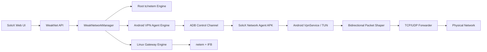

# Android 无 Root 混合弱网设计

## 1. 目标

为 SoloX 增加真实、可验证的 Android 无 Root 弱网能力，同时保留现有 Root `tc/netem` 能力，并提供实验室级 Linux 网关校准模式。

本设计解决以下问题：

- 非 Root 设备目前只能 Ping 探测，不能模拟弱网。
- 当前设备侧 `tc qdisc root netem` 主要作用于出口，不能可靠表示双向弱网。
- HTTP/SOCKS 系统代理无法保证覆盖 UDP、QUIC、自定义 TCP 和不遵循代理设置的应用。
- 现有 Mock 测试不能证明真机实际网络参数符合配置。

## 2. 已验证依据

对 PerfDog Windows 客户端 `v12.1.260536` 中的官方 `PerfDog.apk` 进行静态分析后，确认其无 Root 弱网使用以下结构：

- Android `VpnService` 创建 TUN。
- `addAllowedApplication()` 仅接管指定应用。
- 应用内维护 TCP/UDP NAT 和数据包转发。
- 上下行分别配置带宽、延迟、抖动、丢包及突发参数。
- 支持按协议和目标 IP 过滤。

SoloX 不复用 PerfDog 二进制或代码，只采用经 Android 官方 API 验证的架构思路。

## 3. 总体架构



三种引擎通过统一接口暴露能力：

1. `agent`：默认无 Root 模式，面向单机日常测试。
2. `root_tc`：保留当前实现，兼容已有 Root 设备。
3. `gateway`：实验室校准和正式验收模式，不依赖设备 Root 或 VPN。

首期实现 `agent` 和现有 `root_tc` 的统一选择；`gateway` 首期提供配置契约与验收脚本，不直接管理路由器。

## 4. Android Agent

### 4.1 工程边界

新增仓库内独立模块：

```text
android-agent/
├── settings.gradle.kts
├── build.gradle.kts
├── gradle.properties
└── app/
    ├── build.gradle.kts
    └── src/
        ├── main/
        ├── test/
        └── androidTest/
```

基础要求：

- Kotlin。
- `minSdk 21`。
- 当前稳定 Android SDK 作为 `compileSdk` 和 `targetSdk`。
- 仅使用 Android 官方 `VpnService`、前台服务和本地 IPC。
- APK 包名 `io.solox.networkagent`。
- 不申请 Root、无障碍、证书安装或中间人解密权限。
- 不读取业务明文，不做 TLS MITM。

首期数据面使用受控的 TUN 转发内核。优先评估并固定一个仍维护、许可证兼容、支持 TCP/UDP/IPv4/IPv6 的实现；第三方代码必须锁定版本、记录许可证和校验值。若其整形钩子不能在 IP 包层准确工作，则建立最小受控 Fork。

### 4.2 VPN 路由

- 只允许目标包名进入 VPN。
- Agent 自身加入允许列表后，其出口 socket 必须调用 `VpnService.protect()`，防止路由回环。
- 配置 IPv4 和 IPv6 TUN 地址与默认路由。
- DNS 请求与目标应用其他流量使用相同弱网规则。
- 一次只允许一个目标应用和一份活动配置。

### 4.3 整形模型

上下行参数独立：

- 固定延迟。
- 抖动及分布。
- 随机丢包。
- 突发丢包。
- 带宽限制。
- 可选协议过滤：全部、TCP、UDP。
- 可选目标 IP/CIDR 过滤。

整形必须作用在 IP 包语义层。不能在 TCP 代理字节流已经确认之后简单丢弃数据，否则不会产生真实 TCP 重传行为。

首期不实现：

- 包乱序。
- 包重复。
- 损坏。
- HTTPS 解密。
- 多应用同时选择。
- 后台长期常驻。

### 4.4 控制协议

SoloX 通过 ADB 控制 Agent，不依赖公网服务。

控制方式：

- ADB 检查、安装和升级 APK。
- ADB 启动授权 Activity。
- ADB 广播或显式 Service Intent 下发非敏感启动参数。
- Agent 在应用私有目录维护当前会话状态。
- 状态通过显式广播结果或 `run-as` 不可依赖的公开只读 ContentProvider/本地 socket 返回。

状态模型：

```json
{
  "schema_version": 1,
  "state": "idle|permission_required|starting|active|stopping|error",
  "session_id": "uuid",
  "target_package": "com.example.game",
  "engine_version": "1.0.0",
  "started_at": 0,
  "heartbeat_at": 0,
  "profile": {
    "uplink": {
      "delay_ms": 100,
      "jitter_ms": 20,
      "loss_pct": 1,
      "bandwidth_kbps": 1024
    },
    "downlink": {
      "delay_ms": 100,
      "jitter_ms": 20,
      "loss_pct": 1,
      "bandwidth_kbps": 2048
    }
  },
  "counters": {
    "uplink_packets": 0,
    "downlink_packets": 0,
    "dropped_packets": 0,
    "shaped_bytes": 0
  },
  "last_error": null
}
```

配置必须带 `schema_version`，未知字段可忽略，未知版本必须拒绝。

## 5. SoloX 集成

### 5.1 引擎接口

将现有弱网逻辑拆为适配器：

```python
class WeakNetworkEngine(Protocol):
    def capabilities(self, device_id: str) -> dict: ...
    def apply(self, device_id: str, profile: WeakNetworkProfile) -> dict: ...
    def status(self, device_id: str) -> dict: ...
    def clear(self, device_id: str) -> dict: ...
```

实现：

- `RootTcWeakNetworkEngine`
- `AndroidAgentWeakNetworkEngine`
- 后续 `GatewayWeakNetworkEngine`

`WeakNetworkManager` 负责参数校验、引擎选择和状态归一化。

### 5.2 引擎选择

默认顺序：

1. 用户显式指定的引擎。
2. 已授权并健康的 Agent。
3. Root 且 `tc` 可用的现有引擎。
4. 仅探测模式。

不自动安装 APK，不自动弹出 VPN 授权。第一次使用 Agent 时由用户明确点击“安装/授权”。

### 5.3 API 兼容

保留现有 API：

- `/apm/weaknet/presets`
- `/apm/weaknet/capabilities`
- `/apm/weaknet/status`
- `/apm/weaknet/apply`
- `/apm/weaknet/clear`
- `/apm/weaknet/probe`

新增或扩展参数：

- `engine=auto|agent|root_tc|gateway`
- `target_package`
- `uplink_*`
- `downlink_*`
- `protocol`
- `ip_filter`

旧的 `delay_ms`、`jitter_ms`、`loss_pct` 和 `rate` 继续有效，并映射成上下行相同值，避免破坏现有调用方。

新增 Agent 生命周期 API：

- `/apm/weaknet/agent/status`
- `/apm/weaknet/agent/install`
- `/apm/weaknet/agent/prepare`

安装和授权接口必须是显式操作，不能由页面初始化自动触发。

## 6. 稳定性与回退

### 6.1 失败关闭

只有同时满足以下条件，SoloX 才返回“已应用”：

- VPN 已建立。
- 目标包名已经加入允许列表。
- 数据面线程运行。
- Agent 返回相同 `session_id` 和配置摘要。
- 控制面探针通过。

仅收到启动命令成功不能视为弱网已生效。

### 6.2 自动恢复

- SoloX 停止测试时主动清除 Agent 会话。
- Agent 进程退出时 Android 自动撤销 TUN。
- 配置心跳超时后 Agent 自动停止弱网。
- 新会话启动前必须先清理旧会话。
- 页面和 API 提供“紧急恢复网络”操作。
- Agent 模式失败不能自动切换到 Root 模式并继续测试，防止测试条件悄然变化；必须明确报错并由用户重试或选择其他引擎。

### 6.3 冲突处理

Android 同时只能激活一个用户 VPN。检测到其他 VPN 时：

- 显示冲突应用和处理提示。
- 不强制停止其他 VPN。
- 不将授权失败解释为设备不支持。

VPN 可能改变应用行为或被业务应用检测，因此报告中必须记录引擎类型、Agent 版本和 VPN 状态。

## 7. 网关校准模式

Linux/OpenWrt 网关使用：

- 出口：根 qdisc 整形。
- 入口：IFB 重定向后整形。
- TCP、UDP、IPv4、IPv6 双向支持。
- SoloX 通过 SSH 或预置 HTTP 控制服务应用规则。

网关模式是准确性基准，不作为首期默认用户路径。Agent 每个正式版本必须使用相同配置与网关模式对比。

## 8. 验收设计

### 8.1 自动化测试

Python：

- 参数模型与旧参数兼容。
- 引擎自动选择。
- Agent 安装、版本检查、授权状态和生命周期。
- Agent 未确认生效时 API 返回失败。
- 清理和异常恢复。

Android：

- 配置解析与边界值。
- 上下行调度器。
- 丢包和带宽算法。
- 包名允许列表。
- VPN 生命周期与状态机。
- IPv4/IPv6 数据包分类。

### 8.2 真机测试

至少覆盖：

- Android 8、11、13、15/16 各一台或等效云真机。
- arm64-v8a 为发布必测，x86_64 为模拟器构建验证。
- Wi-Fi 和蜂窝网络。
- TCP 下载/上传。
- UDP echo。
- QUIC/HTTP3。
- DNS。
- IPv4 和 IPv6。
- 前后台切换、锁屏、USB 断开、SoloX 异常退出。

### 8.3 精度门槛

- 无整形 RTT p95 增量不超过 5ms。
- 无整形吞吐不低于直连的 85%。
- 带宽稳态误差不超过 ±10%。
- 延迟误差不超过 ±10% 或 ±10ms，取较大值。
- 丢包使用至少 1000 个 UDP 包统计，目标值应落在预定义置信区间。
- TCP 抓包必须观察到与配置相符的真实重传。
- 上下行分别验收，不使用单一 Ping 结果代替。

### 8.4 报告

报告保存：

- 请求配置。
- 实际生效配置。
- 引擎和版本。
- 设备与 Android 版本。
- 流量及丢包计数。
- 生效前后探针结果。
- 异常和恢复记录。

## 9. 发布策略

分阶段启用：

1. `experimental`：隐藏入口，仅开发和真机校准。
2. `preview`：用户显式开启，保留 Root 默认行为。
3. `stable`：Agent 作为非 Root 默认引擎。

进入 `stable` 前必须完成 Android 版本矩阵、IPv6、TCP/UDP/QUIC、VPN 冲突及网关对比验收。

## 10. 风险

| 风险 | 处理 |
|---|---|
| VPN 与企业 VPN/代理冲突 | 启动前检测并阻止，不强制替换 |
| Agent 自身出口回环 | 所有出口 socket 调用 `protect()` |
| 系统杀死前台服务 | 正确声明前台服务并持续显示通知 |
| Android 新版本后台限制 | 由用户前台显式启动授权流程 |
| 第三方转发内核供应链 | 固定版本、校验值、许可证和受控 Fork |
| IPv6 漏流量 | 未建立 IPv6 路由时拒绝标记为双栈支持 |
| 整形本身影响性能指标 | 报告 Agent CPU/内存开销并建立无整形基线 |
| 测试条件静默变化 | 引擎切换必须显式，不自动降级继续测试 |

